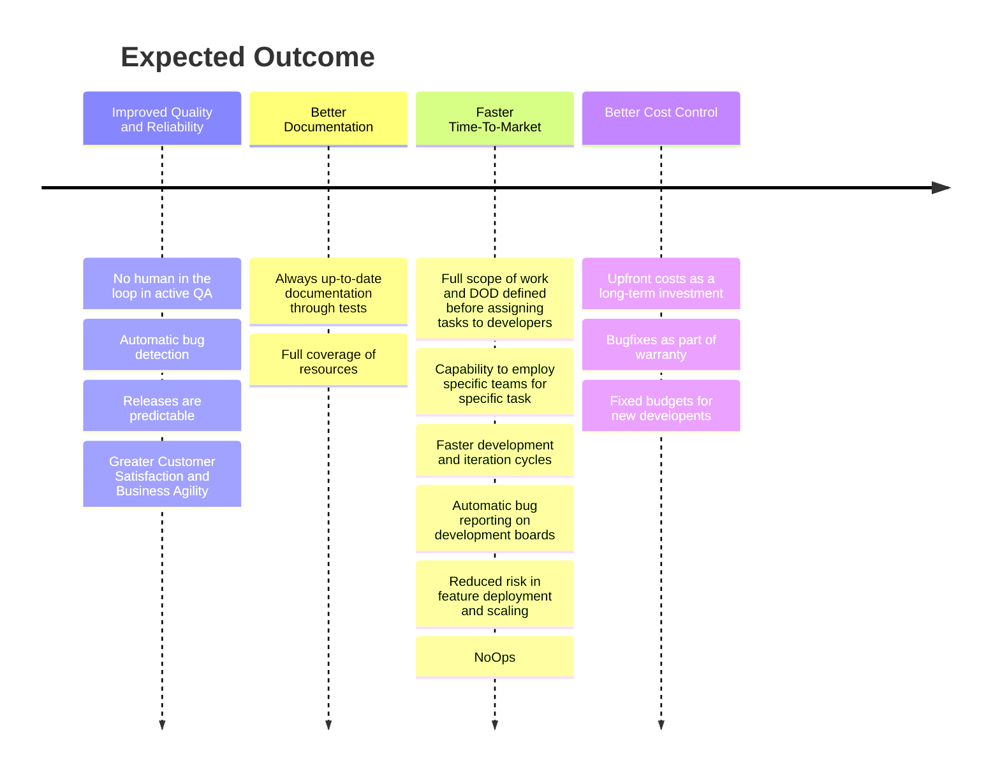
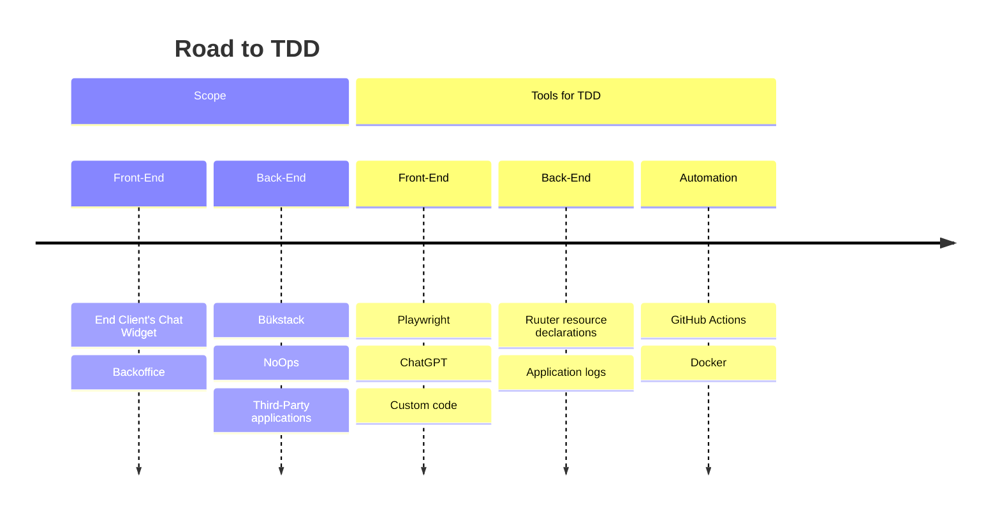

```mermaid
timeline
    title Expected Outcome

    Improved Quality and Reliability
        :   No human in the loop in active QA
        :   Automatic bug detection
        :   Releases are predictable
        :   Greater Customer Satisfaction and Business Agility
    
    Better Documentation
        :   Always up-to-date documentation through tests
        :   Full coverage of resources
    
    Faster Time-To-Market
        :   Full scope of work and DOD defined before assigning tasks to developers
        :   Capability to employ specific teams for specific task
        :   Faster development and iteration cycles
        :   Automatic bug reporting on development boards
        :   Reduced risk in feature deployment and scaling
        :   NoOps
    
    Better Cost Control
        :   Upfront costs as a long-term investment
        :   Bugfixes as part of warranty
        :   Fixed budgets for new developents
```

```mermaid
timeline
    title Road to TDD

    section Scope
        Front-End   :   End Client's Chat Widget
                    :   Backoffice
        
        Back-End    :   Bükstack
                    :   NoOps
                    :   Third-Party applications
    
    section Tools for TDD
        Front-End   :   Playwright
                    :   ChatGPT
                    :   Custom code
        Back-End    :   Ruuter resource declarations
                    :   Application logs
        Automation  :   GitHub Actions
                    :   Docker
```
